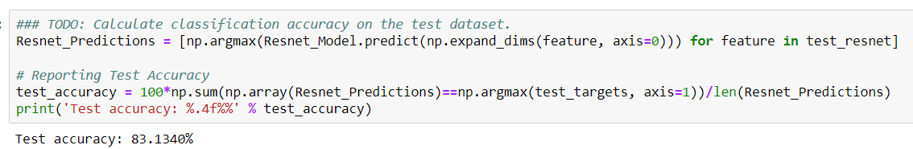

# Capstone - Dog Identification
Author: Zeyao Wang
## Library Used
- panda
- numpy
- re
- pickle
- matplotlib
- seaborn
- sklearn
- operator
- sqlalchemy
- glob
- tqdm
- keras
- PIL

## Project Overview
The project goal is to classify the dog breed. In this project, I am given an image of a dog and use my algorithm to identify an estimate of the canine’s breed. If supplied an image of a human, the code will identify the resembling dog breed. 

## Problem Statement
When people who are not familiar with dog wants to know the dog breed if they see a picture, this app is helpful for them to identify which dog breed is. 

## Files Description
1. `dog_app.ipynb`: 
    - load train, test, and valid dataset for dog dataset and human dataset
    - detect human face and dog by making prediction with ResNet-50 
    - create a CNN to Classify Dog Breeds from Scratch
    - use a CNN to Classify Dog Breeds including Bottleneck Features
    - create a CNN to Classify Dog Breeds by using Transfer Learning
    - create my algorithm to detect human, dog, or neither

## Instructions:
1. Run `dog_app.ipynb`:  
    - Run data exploration and preprocessing codes
    - Upload a image, then run the function `breed_algorithm`, it will give you detection result - whethere it is a dog or human or neither - then it will return a predicted dog breed. 
    - For example, upload the picture:

    

    Result you will get is "This is predicted to be a dog, and its breed is:  'Maltese'". 
 
 ## Metrics
Metrics are measures of quantitative assessment used for comparing and tracking peformance or production. In the project, I used the ResNet-50 bottleneck features to identify dog breed from images,. And after training and testing the model, I checked the accuracy which shows **83%** accuracy which is good!

## Acknowledgment
Here are some reference of function use:
- https://pytorch.org/docs/stable/generated/torch.nn.Conv2d.html
- https://www.tensorflow.org/api_docs/python/tf/keras/callbacks/ModelCheckpoint

